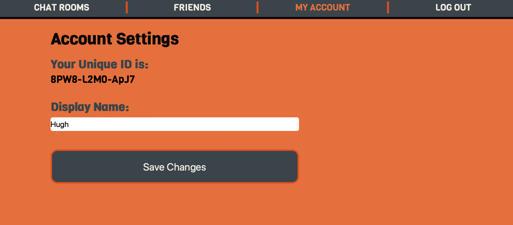
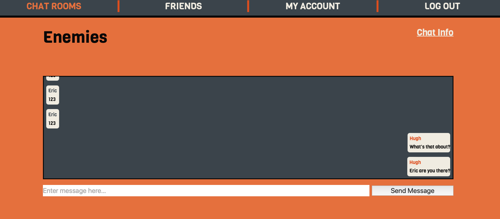

# Messenger App
A Messenger type application that takes inspirattion from Groupme, Whatsapp, and Slack. They app uses Google authentification to authorize a user. The user is then able to create a username, a group chat and messages. They are able to then read messages. They can also update their username, friends list, and chat information. Finally they can delete friends.

# Screenshot(s)

# Technologies Used
- 
- 
- 
- 
- 
- 
- 
- 
- 

# Getting Started

## [Click here to check it out!](https://messenger-app-2023.herokuapp.com)

# Next Steps
- Add more crud options to models
- Implement socket technology
- Change navigation?